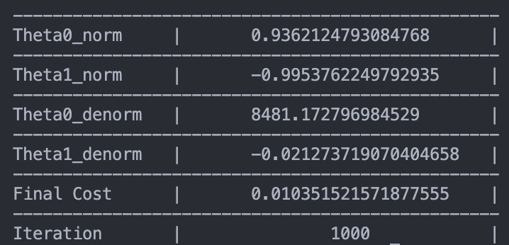
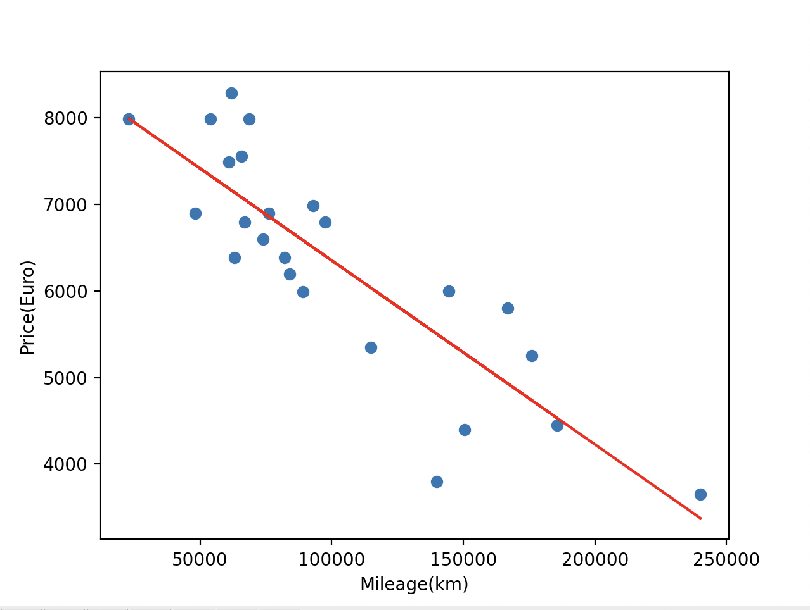
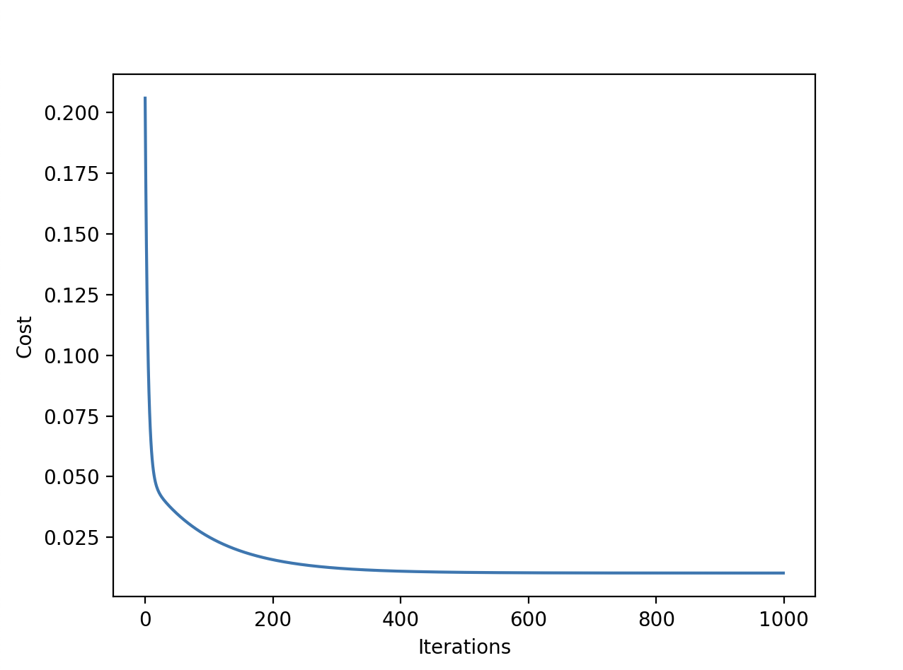

# Linear Regression (Mileage → Price)

Train a simple linear regression model using gradient descent to predict car prices from mileage. Visualize the fitted line and the cost over iterations.

## Project Structure
- `train.py`: normalization, gradient descent training, denormalization, plots.
- `predict.py`: price prediction using saved thetas.
- `data.csv`: raw dataset (`km`, `price`).
- `values.json`: saved `Theta0` and `Theta1`.

## Setup
- Python 3.9+
- Install:
```sh
pip install -r requirements.txt
```

## Usage
Run the trainer:
```sh
python3 train.py
```
Choose:
- 1: Train with raw data
- 2: Visualize regression results
- 3: Visualize cost function over iterations
- 4: Quit

Run prediction (uses saved thetas):
```sh
python3 predict.py
```

## How Training Works (Gradient Descent)
- Data is normalized to [0, 1] for stable updates.
- Gradients:
  - `theta1` (slope): mean of residual × x (`w_theta1_gradient`)
  - `theta0` (intercept): mean of residual (`b_theta0_gradient`)
- Parameters are updated each iteration: `theta -= lr * gradient` (`gradient_update_rule`).
- After training, thetas are denormalized to original scale (`denormalize`) and saved (`set_thetas`).
- Cost is mean squared error (`cost_function`), tracked per iteration.

## Visuals
Place generated images in `./assets`:
- Raw data table: 
- Regression plot (option 2): 
- Cost over iterations (option 3): 

## Notes
- The learning rate is `0.1` and default iterations are `1000` (`launch_train`).
- Plots use Matplotlib; data is read via Pandas.